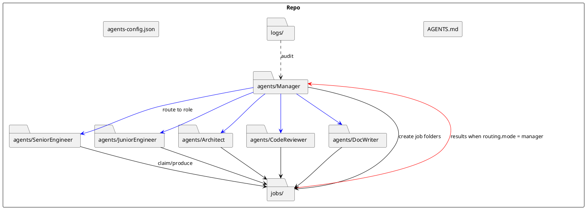
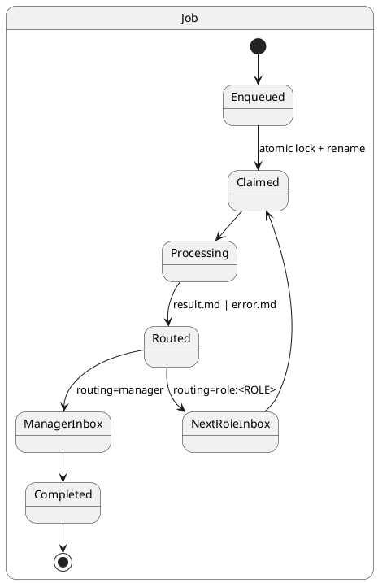

# SPEC-1-farro — filesystem-based autonomous REPL-ready role‑routing orchestrator

## Background

**Project codename: farro** (filesystem-based autonomous REPL-ready role‑routing orchestrator).

We are designing a cross-platform (Windows and Linux) filesystem-first orchestration pattern for autonomous agents collaborating in a single repository. The system centers on a **Manager** role that plans, schedules, and routes work to specialized **Worker** roles: **Senior Engineer, Junior Engineer, Architect, Code Reviewer, Doc Writer**. Work moves through role-specific directories with `incoming/` queues as job folders and minimal external dependencies so it can run locally or in CI on any OS.

Portability considerations:
- Use path-agnostic code and atomic directory moves (rename) with retry for both Windows and Linux.
- Prefer lock files over process signals; use file-system locks (create-exclusive) to avoid race conditions.
- No external DB/queue in v1; all state is on disk and CI-friendly.
- **Language/runtime**: Clojure (JVM) packaged as an uberjar for both OSes; configuration files are **JSON**.

## Requirements

### Must-Have (M)
- Cross-platform operation: Windows 10+/Windows Server and modern Linux distros; portable path handling and atomic moves.
- Repository-local, dependency-light runtime: no external DB/queue; runnable locally and in CI.
- Roles: Manager, Senior Engineer, Junior Engineer, Architect, Code Reviewer, Doc Writer.
- Canonical job artifact: `jobs/<job-id>/` with **`prompt.json` (required)**, optional `prompt.md` (narrative only), deterministic folder naming (`job-YYYYMMDD-hhmmss-<rand>`).
- Routing: explicit `routing` block in **`prompt.json`** to either next role or Manager; Manager may override routing.
- Per-role queues: `incoming/`, `in-progress/`, `completed/` with atomic handoff between roles.
- Idempotent role scripts: safe to re-run on the same job folder; do not corrupt artifacts.
- Observability: append-only audit log `logs/audit.log` capturing job lifecycle transitions with timestamps and role IDs; **durability policy** defined below.
- Concurrency: safe multi-process execution on a single machine; **2 workers per role** for MVP.
- Throughput target: **100 jobs/day** nominal.
- Security: role scripts respect `allowed_paths` from **`prompt.json`**; no writes outside permitted areas; secrets never logged.
- Provider configuration: single repo-level **`agents-config.json`** supporting multiple providers (OpenAI, Google, OpenRouter, CLI) with per-role model selection.
- **Watchdog**: Manager watchdog CLI to detect stale/orphaned jobs and requeue; promoted to **Must-Have** with thresholds below.
- **Backpressure**: per-role and global queue caps; Manager pauses new enqueues when caps are exceeded (rules below).

### Should-Have (S)
- `job.json` state file with status, timestamps, attempts, actor, and next role (Phase 2).
- Metrics: per-role throughput, average latency, failure rate exported as newline-delimited JSON or CSV.
- Policy versioning: `AGENTS.md` and `AGENTS-ROLE.md` include semver header; jobs record policy version used.
- Fast-path approvals: option to route Worker output directly to the next role without Manager approval when rubric allows.
- Optional local/offline providers via adapters (future extension point).

### Could-Have (C)
- OAuth-based provider auth (post-MVP); shared credential store.
- Workspace snapshots (e.g., zip/tar) attached to jobs for reproducible runs.
- Multi-repo support via repo registry and per-repo config.

### Won’t-Have (W) for MVP
- Distributed multi-host locking and coordination.
- External queue or database.
- Automatic push to remote Git on completion (manual or CI step only).

## Method

### 0) Evolution of on-disk artifacts (make implicit explicit)
- **Phase 1**: Job folder contains **`prompt.json`** only; state is implicit via directory location + audit log.
- **Phase 2**: Add **`job.json`** as canonical job state; workers treat **`prompt.json`** as the raw prompt payload and **`job.json`** as the authoritative lifecycle record.
- **Phase 3**: Jobs may reference a **`tasks/<id>.json`** or **`tasks/<id>.md`** artifact as a reusable “task spec” spanning multiple hops.

### 1) Architecture Overview
- **Filesystem-first orchestration** inside a single repository.
- **Roles as processes**: one executable per role; up to 2 concurrent workers per role in MVP.
- **Manager** manufactures jobs and routes results; **Workers** (Senior/Junior Engineer, Architect, Code Reviewer, Doc Writer) process role-specific prompts.
- **Queues** are just directories; **transitions** are implemented via atomic renames with lock files for ownership.



### 2) Directory & File Conventions
```
AGENTS.md                        # global policies & routing rules (semver header)
agents/
  <Role>/
    AGENTS-ROLE.md               # role policy & rubric
    incoming/                    # unclaimed job folders
    in-progress/                 # claimed with lock
    completed/                   # successful results
jobs/
  job-YYYYMMDD-hhmmss-<rand>/
    prompt.json                  # REQUIRED: role, rubric, allowed_paths, success, routing
    prompt.md                    # OPTIONAL narrative/context only
    payload/                     # optional inputs (patches, assets)
    result.md | error.md         # written by worker
    job.json                     # Phase 2 metadata (status, timestamps, attempts)
    .snapshot/                   # immutable copies of config captured on claim (see §5, §8)
logs/
  audit.log                      # append-only lifecycle log (see durability & rotation)
agents-config.json               # provider keys, models, timeouts, security
schemas/
  agents-config.schema.json
  prompt.schema.json
```

### 3) Canonical JSON Schemas
- `schemas/agents-config.schema.json` and `schemas/prompt.schema.json` as in the prior draft; `doctor` validates both at startup and via CLI.

#### 3.1 Prompt/Job/Config Contracts — authoritative

**Roles (enum)**: `Manager`, `SeniorEngineer`, `JuniorEngineer`, `Architect`, `CodeReviewer`, `DocWriter`.

**Routing (enum)**:
- `{"mode":"manager"}`
- `{"mode":"role","next":"<Role>"}` where `<Role>` is one of the roles above.

**prompt.json — required/optional**
- **Required**: `role` (enum Role), `rubric` (string ≤ 10k), `allowed_paths` (array of strings ≥1), `success` (string ≤ 5k), `routing` (object per enum),
- **Optional**: `context_md` (string filename), `inputs` (object), `metadata` (object).

**allowed_paths semantics**
- Paths are interpreted **relative to repo root** unless they begin with `/` or a Windows drive letter.
- On load: normalize (`..` collapse), reject absolute paths unless `agents-config.json.security.allow_absolute_paths=true`.
- Enforced **deny on mismatch**: any write outside normalized allowlist → hard fail + audit.

**agents-config.json — required/optional**
- **Required**: `version` (semver), `providers` (object with provider keys), `security.max_job_bytes` (int), `security.payload_allowlist` (array of extensions).
- **Optional**: per-provider model maps, `timeouts`, CLI provider settings, `security.allow_absolute_paths` (bool, default false).

**job.json (Phase 2)**
```json
{
  "job_id": "job-20251116-120301-1234",
  "role": "SeniorEngineer",
  "status": "queued|in_progress|succeeded|failed|killed|stale",
  "attempt": 1,
  "created_at": "2025-11-16T12:03:01Z",
  "updated_at": "2025-11-16T12:04:10Z",
  "finalized_at": null,
  "routing": { "mode": "role", "next": "CodeReviewer" }
}
```

**Strict example — prompt.json**
```json
{
  "role": "SeniorEngineer",
  "rubric": "Implement the change and produce a PR-ready diff.",
  "allowed_paths": ["src/", "docs/", "tests/"],
  "success": "Tests pass; reviewer rubric satisfied.",
  "routing": { "mode": "role", "next": "CodeReviewer" },
  "context_md": "prompt.md",
  "inputs": { "task_id": "task-0001" },
  "metadata": { "priority": "P2" }
}
```

**Validation rules (doctor)**
- Enforce enums and required fields; reject unknown `routing.mode`; reject empty `allowed_paths`.
- For absolute `allowed_paths` when not allowed: fail fast.

#### 3.2 Schema files
- `schemas/prompt.schema.json`, `schemas/agents-config.schema.json` define the above; `doctor` must pass before daemon startup.

### 4) Job Lifecycle & Handoff
1. **Enqueue**: Manager or CLI writes `jobs/job-.../prompt.json` (may include `context_md` filename) and moves folder to target role’s `incoming/`.
2. **Claim**: Worker process performs create-exclusive of `lock` file inside job folder and atomically renames the folder into `agents/<Role>/in-progress/`.
3. **Process**: Worker reads role policy + `prompt.json` (and optional `prompt.md`), calls provider, writes `result.md` or `error.md`.
4. **Route**: Based on `routing` block in `prompt.json`:
   - `manager` → move job to `agents/Manager/incoming/`.
   - `role:<ROLE>` → move job to that role’s `incoming/`.
5. **Complete**: Manager (or terminal role) moves job to `completed/`; append lifecycle entries to `logs/audit.log` at each transition.



#### 4.1 Explicit status ↔ lifecycle mapping (unambiguous)
| `job.json.status` | Lifecycle state(s) in diagram |
|---|---|
| `queued` | **Enqueued / ManagerInbox / NextRoleInbox** |
| `in_progress` | **Claimed / Processing** |
| `succeeded` | **Completed (terminal)** |
| `failed` | **Completed (terminal)** |
| `killed` | **Completed (terminal)** |
| `stale` | **Watchdog-requeued state prior to requeue/kill** |

### 5) Cross-Platform Locking & Atomicity
- Use **create-exclusive** semantics to create `lock` file; if exists, skip.
- Use **atomic directory rename** for queue transitions (supported on NTFS/ext* within same volume).
- Write artifacts to temp names then rename (`*.tmp` → final) to avoid partial reads.
- Implement retry with jitter on `PermissionError`/`AccessDenied` (Windows AV interference) and `EBUSY`/`EXDEV`.

**Cross-volume behavior (explicit)**
- **MUST fail fast** if source and destination reside on different volumes/devices (ATOMIC_MOVE unavailable). Default: exit with error; audit event `cross_volume_forbidden`.
- `allow_cross_volume`: **false** by default. If explicitly set true, fallback is **copy→fsync→rename→fsync** with a final atomic rename into destination directory; this mode is **not** atomic end-to-end and is **unsupported** for production.
- `doctor` verifies queue roots share the same device; refuses to start in strict mode if not.

**Networked filesystems**
- Unsupported for MVP unless they provide local semantics for exclusive create + rename atomicity. `doctor` attempts a capability probe; if unknown, refuse to start in strict mode.

### 6) Provider Adapters (HTTP & CLI)
- Interface and contracts unchanged; enforce `timeouts.cli_seconds` and map nonzero exit codes to errors; redact secrets.

### 7) Security & Guardrails (hardened)
- Enforce `allowed_paths` writes via a path filter wrapper around file I/O.
- Do not log secrets or full prompts unless explicitly allowed.
- **Payload allowlist**: `payload/` files limited to extensions `[.md, .txt, .json, .patch, .diff, .png, .jpg, .svg, .zip]` (configurable).
- **Per-job artifact cap**: default **25 MiB** total across `payload/` and outputs; hard fail and audit on exceed; configurable via `agents-config.json.security.max_job_bytes`.
- **CLI providers** sandbox: run with temp working dir; pass only whitelisted env vars; redact audit lines.

### 8) Observability: audit durability, rotation, and redaction (tightened)
- **Durability**: audit writer is append-only; fsync policy `mode=buffered` (flush at most every **1s** or on process exit) with `mode=strict` override to fsync each line for CI.
- **Format**: NDJSON, one event per line; clock in UTC.
- **Rotation**: size-based **50 MiB** per file; keep **10** rotated files (`audit.log`, `audit.log.1` … `audit.log.9`); also daily time-cut at UTC midnight to start a fresh file.
- **Quota**: cap total log size to **512 MiB**; on exceed, delete the oldest rotated file and audit the deletion event.
- **Doctor checks**: verify writable log dir, current file size, rotation/quota config present; integrity scan on boot for truncated lines.
- **Redaction policy (explicit)**:
  - Audit records **MUST only contain**: `job_id`, `role`, `status`, timestamps, routing info, and high-level error categories.
  - Audit logs **MUST NOT** store PII, nor API keys / headers, nor full prompts by default.

### 9) Resilience: retries & backoff (pinned)
- **Policy**: **decorrelated jitter backoff** with base 250ms, multiplier 1.5, max delay 10s, max attempts 4 (HTTP); for CLI providers, max attempts 2 with the same backoff.
- **Retryable**: HTTP 429/5xx, network timeouts; CLI exit codes ≠0 unless marked `fatal` in adapter.
- **Idempotency**: workers are idempotent; repeated attempts must not duplicate outputs; write to temp, rename on success.

**Idempotency & partial results (authoritative)**
- All writes use `*.tmp` then rename.
- Each attempt writes into `attempts/NNNN/` and then refreshes top-level symlinks/files:
  - On success: place `result.md` at top-level mirroring `attempts/NNNN/result.md`; remove any top-level `error.md`.
  - On failure: place `error.md` at top-level mirroring `attempts/NNNN/error.md`; do not overwrite an existing `result.md` unless a newer success occurs.
- **Authoritative precedence**: the **latest attempt wins**; top-level `result.md` present ⇒ `job.json.status=succeeded`. If only `error.md` present ⇒ `status=failed` (unless retries remaining). `finalized_at` set only when Manager moves to `completed/`.
- Restarts: a worker finding both files at top-level MUST reconcile from `attempts/` by highest attempt number and fix the mirror, then continue.

### 10) Capacity Management & Backpressure (new)
- **Per-role queue cap**: default **200** jobs in `incoming/ + in-progress/`.
- **Global cap**: default **1000** jobs across all roles.
- **Admission control**: `agent-cli enqueue` fails fast with nonzero exit when the target role cap is exceeded unless `--force` and caller has permission.
- **Manager behavior**: in auto-plan mode, halt generation when any role is above 80% of cap; resume below 60%.
- **SLO tie-in**: caps sized to meet 100 jobs/day with 2 workers/role at P95 ≤ 5 minutes.
- Defaults confirmed by owner (2025-11-16).

### 11) Processing algorithm (per role worker; config snapshot to avoid mid‑flight drift)
1. Scan `incoming/` for job folders; sort FIFO by folder mtime.
2. For each candidate:
   - Try to create `lock` inside; on failure, skip.
   - Rename job to `in-progress/`.
   - **On claim, snapshot config**: copy `agents-config.json` and `policy.lock.json` into `jobs/<id>/.snapshot/` and treat these as **immutable** for the duration of this job. If files on disk change mid-run, those changes only affect newly claimed jobs.
   - Load role policy, `prompt.json` (optional `prompt.md`), and the **snapshot** config.
   - Select provider/model per role from config; inject API key/env.
   - Execute call via HTTP or CLI provider; stream to temp file; rename to `result.md`.
   - On failure, write `error.md`, increment attempt, decide retry or terminal fail (per policy).
   - Route by `routing` in `prompt.json`: move to Manager or `role:<ROLE>` `incoming/`.
   - Append audit event.

### 12) Manager watchdog & routing (must‑have; availability explicitly tied to status)
- **Watchdog thresholds**: `stale_after` = **30m** without mtime change in `in-progress/`; `abandon_after` = **2h** overall job age.
- **Recovery actions**: `list-stale`, `requeue <job-id>`, `kill <job-id>`, `force-complete <job-id>`.
- **Auto-Plan mode**: gated by flag; obeys backpressure; upper bound on generated jobs.

**Manager availability & routing guarantees (clarified)**
- Workers **never bypass** `routing.mode=manager`. If Manager is unavailable, workers retry routing with backoff up to their max attempts.
- If routing retries are exhausted due to Manager unavailability, the worker **leaves the job in `in-progress/` with `error.md` and sets `job.json.status="stale"`**. This clearly marks the job for watchdog handling.
- Watchdog requeue: when requeuing a stale job back to the target role’s `incoming/`, it **sets `status="stale"`** (if not already), **increments `attempt`**, and appends audit lines. Subsequent claims reset `status` to `in_progress`.
- Optional degraded mode flag `--degraded-bypass` (off by default) allows workers to route directly to the next role only when explicitly configured; all such actions are audited with `degraded_bypass=true`.
- Manager heartbeat: `agents/Manager/.heartbeat` updated every 10s; workers warn if stale >30s and include in audit.

### Decisions locked for MVP

1) **Routing‑exhaustion handling (final):** When a worker cannot route to the Manager after configured retries/backoff, it **sets `job.json.status = "stale"` immediately**, writes `error.md`, and leaves the job in `in-progress/`. The watchdog later requeues or kills; requeue **increments `attempt`** and preserves `status = "stale"` until the next claim sets `in_progress`. *Rationale:* fast and explicit signaling, simpler SLOs/alerting, clear forensics.

2) **Config snapshot strategy (final):** On claim, the worker creates physical copies of **`agents-config.json`** and **`policy.lock.json`** in `jobs/<id>/.snapshot/` and treats them as **immutable** for that job. Hashes may be recorded in `job.json` for quick indexing, but the copies are the source of truth for replay. *Rationale:* strong reproducibility and self-contained audits.

> Retention note: snapshot size is typically small; for long‑running installations, add a housekeeping task to prune `.snapshot/` from terminal jobs older than a retention window (e.g., 30–90 days), configurable per repo.

## Implementation

### A) Reference runtime (Clojure-based, portable)
- **Language/Runtime**: Clojure on JVM. **Target JDK: 17 LTS** with CI matrix also testing JDK 21 LTS.
- **Packaging**: uberjar via `clojure -T:build uber`; run with `java -jar build/agents-orchestrator.jar`.
- **Processes**: one long-running process per role (agent daemon); a Manager daemon; a CLI for control.
- **Concurrency**: `core.async` channels; 2 go-loops per role to meet MVP throughput.
- **Discovery**: `WatchService` for directory events with periodic polling fallback.
- **Locking**: `FileChannel.lock()` + `lock` marker file.
- **Atomic moves**: `Files.move(src, dst, ATOMIC_MOVE, REPLACE_EXISTING)` within same volume.
- **Config**: read `agents-config.json`; expand `${VAR}` from environment.
- **Logging**: NDJSON to `logs/audit.log` using simple append utility honoring durability/rotation policy.
- **CLI provider support**: optional shell-out adapters.

### B) Directory scaffold (scripted)
```
app/
  src/agents/orchestrator/
    core.clj            # shared helpers (paths, JSON, env expansion)
    fs.clj              # atomic moves, locks, watch service
    cli.clj             # command dispatch
    managerd.clj        # manager loop (routing + auto-plan)
    agentd.clj          # role worker loop
    providers/
      openai.clj
      google.clj
      openrouter.clj
      cli_provider.clj  # generic CLI adapter
  resources/
  test/agents/orchestrator/
    core_test.clj
bin/
  agentd                # bash launcher -> java -jar build/agents-orchestrator.jar agentd
  agentd.cmd            # Windows -> @echo off & java -jar build\agents-orchestrator.jar agentd %*
  managerd              # bash launcher -> java -jar build/agents-orchestrator.jar managerd
  managerd.cmd          # Windows -> @echo off & java -jar build\agents-orchestrator.jar managerd %*
  agent-cli             # bash launcher -> java -jar build/agents-orchestrator.jar cli
  agent-cli.cmd         # Windows -> @echo off & java -jar build/agents-orchestrator.jar cli %*
build.clj               # tools.build script (uber)
deps.edn                # dependencies & aliases (:run, :uber, :test)
```
`init` creates:
```
agents/{Manager,SeniorEngineer,JuniorEngineer,Architect,CodeReviewer,DocWriter}/{AGENTS-ROLE.md,incoming,in-progress,completed}
jobs/  logs/  tasks/  schemas/
```

### C) CLI specifications (JSON‑canonical)
- **Enqueue**: `agent-cli enqueue --role SeniorEngineer --task tasks/task-0007 --prompt-json prompt.json [--context-md prompt.md]`
  - Validates against `schemas/prompt.schema.json` (hard fail on error).
  - Validates `allowed_paths` and routing block; writes job folder to target role `incoming/`.
  - `prompt.json` is **required**; `prompt.md` is optional narrative context.
- **Run worker**: `agentd --role SeniorEngineer --workers 2`
- **Manager**: `managerd --auto-plan=off|on` with backpressure awareness.
- **List**: `agent-cli ls --role CodeReviewer --state incoming|in-progress|completed`.
- **Requeue/kill**: `agent-cli requeue <job-id>` / `agent-cli kill <job-id>`.
- **Stats**: `agent-cli stats` -> NDJSON/CSV.
- **Provider test**: `agent-cli provider-test --role DocWriter` runs a sample prompt through the configured provider (HTTP or CLI) to validate environment and timeouts.
- **Doctor**: validates Java, schemas, presence of required CLIs, single-volume moves, write perms, and log durability/rotation settings.

### D) CI hardening (reference)
- **Gates**
  - `doctor` must pass.
  - Schemas validate (`schemas/*.json`).
  - Smoke test enqueues one job and asserts end‑to‑end completion ≤ 5 min.
- **Mandatory failure behavior (explicit)**
  - If **doctor fails** or **any smoke test fails**, CI **MUST fail**. Logs are uploaded **only on failure** for forensic debugging.
- **Workflow outline** (Linux & Windows)
  1) Matrix: `{ os: [ubuntu-latest, windows-latest], jdk: [17, 21] }`.
  2) Cache `~/.m2` / deps via setup-java.
  3) Build uberjar via tools.build.
  4) Run `doctor` and schema validation.
  5) Start manager & one worker (background), run smoke test script.
  6) Upload `logs/audit*` as artifacts on failure.

### E) Load‑test harness (reference)
- Validate P95 latencies and backpressure by enqueuing N synthetic jobs (scripts provided in repo templates).

## Milestones
1. **M0 – Scaffolding (1–2 days)**: Repo layout, config, empty daemons, CLI skeleton, audit writer with durability & rotation.
2. **M1 – Core Loop (3–5 days)**: Claim/rename, result routing, Manager manual mode, 2 workers/role.
3. **M2 – Resilience (3–4 days)**: Retries/backoff pinned, `job.json`, watchdog, stats, backpressure.
4. **M3 – Task Artifacts (2–3 days)**: `tasks/` schema, Architect workflow, state model.
5. **M4 – Auto-Plan (3–5 days)**: Manager synthesis mode gated by flag; safety caps.
6. **M5 – CI Hardening (1–2 days)**: CI checks, sample workflows, Windows launchers verified.
7. **M6 – Conformance profile & tests (1–2 days)**: Generate `policy.lock.json` capturing pinned parameters (backoff, quotas, caps, thresholds) and add `conformance.md` with a machine-checkable checklist; `doctor --conformance` verifies.

## Gathering Results
- **Functional acceptance**: sample Task runs through Manager → Engineer(s) → Reviewer → Doc Writer without manual intervention; artifacts consistent with `task.md`.
- **SLOs**: P95 single-job latency per role ≤ 5 minutes; ≤ 2% failure rate; throughput ≥ 100 jobs/day.
- **Metrics**: throughput/latency/failure per role, queue depth over time.
- **Audits**: weekly review of audit log for stuck jobs; spot-check routing correctness; confirm rotation/quota behavior.
- **Postmortems**: template stored in `docs/ops/postmortems.md` for terminal failures.

## Appendices

### Appendix A — Runbook & on‑call (MVP)

**Pager triggers**
- Watchdog requeues > 20 in 5 minutes → page.
- Any role queue depth > 80% for 30 minutes → page.
- Audit writer errors > 3/min or log quota breach → page.

**Triage flow**
1) `agent-cli stats` → identify hot role; confirm caps.
2) `agent-cli ls --role <R> --state in-progress` → check oldest mtime.
3) `managerd watchdog list-stale` → verify staleness; `requeue` as needed.
4) Inspect `logs/audit.log` tail; look for repeated 429/5xx or CLI failures.
5) If provider throttling: raise backoff caps temporarily and pause auto‑plan.

**Rollback/mitigation**
- Pause auto‑plan: `managerd --auto-plan=off`.
- Reduce concurrency to 1 worker/role if FS contention.
- Revert to prior `agents-config.json` and revalidate with `doctor`.

**Commands cheat‑sheet**
```
agent-cli stats
agent-cli ls --role <Role> --state incoming|in-progress|completed
managerd watchdog list-stale
managerd watchdog requeue <job-id>
managerd --auto-plan=off
```

### Appendix B — GitHub Actions CI workflow (reference)

**File:** `.github/workflows/farro-ci.yml`

```yaml
name: farro CI
on:
  push:
    branches: [ main ]
  pull_request:
    branches: [ main ]

jobs:
  build-test:
    strategy:
      fail-fast: false
      matrix:
        os: [ubuntu-latest, windows-latest]
        jdk: [17, 21]
    runs-on: ${{ matrix.os }}
    steps:
      - name: Checkout
        uses: actions/checkout@v4

      - name: Setup Java ${{ matrix.jdk }}
        uses: actions/setup-java@v4
        with:
          java-version: ${{ matrix.jdk }}
          distribution: temurin
          cache: maven

      - name: Setup Clojure CLI
        uses: DeLaGuardo/setup-clojure@v11
        with:
          cli: latest

      - name: Cache Gitlibs
        uses: actions/cache@v4
        with:
          path: |
            ~/.gitlibs
            ~/.m2
          key: gitlibs-${{ runner.os }}-${{ matrix.jdk }}-${{ hashFiles('**/deps.edn') }}

      - name: Build uberjar
        run: clojure -T:build uber
        shell: bash

      - name: Doctor & schema validation
        run: |
          java -jar build/agents-orchestrator.jar doctor
          test -f schemas/prompt.schema.json
          test -f schemas/agents-config.schema.json
        shell: bash
        if: runner.os == 'Linux'

      - name: Doctor & schema validation (Windows)
        run: |
          java -jar build\agents-orchestrator.jar doctor
          if (!(Test-Path schemas/prompt.schema.json)) { exit 1 }
          if (!(Test-Path schemas/agents-config.schema.json)) { exit 1 }
        shell: pwsh
        if: runner.os == 'Windows'

      - name: Start manager & one worker (Linux)
        run: |
          nohup java -jar build/agents-orchestrator.jar managerd --auto-plan=off > manager.log 2>&1 &
          nohup java -jar build/agents-orchestrator.jar agentd --role SeniorEngineer --workers 1 > worker.log 2>&1 &
        shell: bash
        if: runner.os == 'Linux'

      - name: Start manager & one worker (Windows)
        run: |
          Start-Process -FilePath java -ArgumentList '-jar','build\agents-orchestrator.jar','managerd','--auto-plan=off' -NoNewWindow
          Start-Process -FilePath java -ArgumentList '-jar','build\agents-orchestrator.jar','agentd','--role','SeniorEngineer','--workers','1' -NoNewWindow
        shell: pwsh
        if: runner.os == 'Windows'

      - name: Smoke test (Linux)
        run: bash scripts/smoke.sh
        if: runner.os == 'Linux'

      - name: Smoke test (Windows)
        run: pwsh -File scripts/smoke.ps1
        if: runner.os == 'Windows'

      - name: Upload logs on failure
        if: failure()
        uses: actions/upload-artifact@v4
        with:
          name: logs-${{ runner.os }}-${{ matrix.jdk }}
          path: |
            logs/*
            *.log
```

**Notes**
- If doctor fails or any smoke test fails, CI must fail; logs are uploaded only on failure for forensic debugging.

### Appendix C — Example configs & harnesses

- Examples and load-test scripts remain as in prior draft; casing updated to **farro** where applicable.

## Conformance profile (STRICT‑MVP v1.0)
- **Schema versions**: `prompt.schema.json@1.0.0`, `agents-config.schema.json@1.0.0`.
- **Pinned policies**: backoff base 250ms/×1.5/max10s/4 attempts (HTTP), 2 attempts (CLI); audit rotation 50 MiB ×10 files + daily cut, 512 MiB cap; watchdog stale 30m/abandon 2h; queue caps 200/role, 1000 global; backpressure pause ≥80%, resume ≤60%.
- **Doctor gates**: same-device check required; network FS unsupported; absolute paths forbidden unless config override; enums enforced; unknown fields rejected in strict mode.

## Conformance checklist (for one‑shot agents)
- [ ] `doctor` passes in strict mode.
- [ ] Schemas validate and enum/required checks enforced.
- [ ] Same-volume verified; cross-volume forbidden.
- [ ] Backoff parameters match pinned values.
- [ ] Log durability/rotation verified by probe write.
- [ ] Watchdog thresholds present; heartbeat healthy.
- [ ] Example job executes end‑to‑end and lands in `completed/`.


